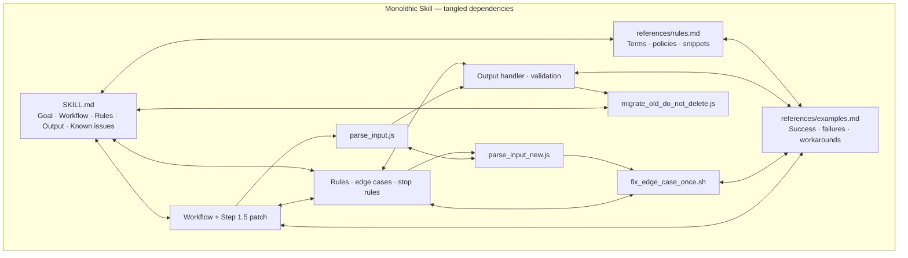
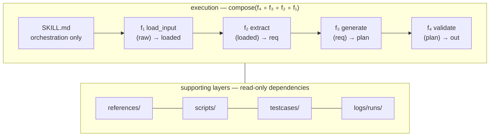

# Functional Skill Creator

> **Maintain Agent Skills with functional programming discipline.**

Functional Skill is an engineering methodology designed for complex skill maintenance and iteration. Combined with trace logging and unit testing, it makes skills **modular, traceable, and testable**.

- Treat each `Step` as a `Function` with explicit `Input/Output` (pure function first)
- `SKILL.md` only orchestrates the pipeline of `Function`s, consuming only `external inputs` and `reference dependencies`
- Shared rules across `Function`s go into `references/`
- Deterministic logic called by `Function`s becomes `scripts/`
- Add trace logging for every `Function`, recording input/output/token consumption/duration
- Equip every `Function` with unit tests and E2E tests, ensuring neither individual Functions nor the full pipeline regress

## Quick Start

### Install
```bash
npx skills add AGI-comming/functional-skill-creator --skill fskill-creator -y
```
Install via [skills.sh](https://skills.sh/). Add `-a <agent>` to target a specific agent; add `-g` only if the agent supports global install.

### Usage
**Create** – generate a new functional skill from a workflow brief:
```
/fskill-creator create a functional skill for <workflow>
```
**Migrate** – convert an existing legacy skill directory into a functional skill:
```
/fskill-creator migrate <path-to-skill-dir>
```
Optional flags: `include_report`, `include_unittest`, `include_viewers` (default `true`). Set to `false` to skip.

## Why Use Functional Skill?
As skills evolve, `SKILL.md` and `references/*.md` can become unwieldy prose walls. Functional Skill separates concerns:
- **Functions**: pure logic with explicit contracts
- **References**: shared rules and glossaries
- **Scripts**: deterministic actions
- **Tests & Logs**: regression safety and observability

### Before vs. After



## When to Use
- Maintaining a long‑evolving skill that needs regression safety
- Existing `SKILL.md` and `references/` have become unmanageable
- You want to extract deterministic work (parsing, formatting, validation) into reliable scripts
- You need traceable execution to pinpoint failures
- You wish to turn real runs into repeatable test suites

## Report Log and Unittest Capabilities
- `scripts/report.mjs`: writes function‑level report logs (`report_mode=off|local|remote`)
- `scripts/runtime.mjs`: exports `runStep`, `writeStepReport`, `applyReportMode`
- `scripts/test_report.mjs`: validates JSONL report output and redaction of sensitive fields
- `scripts/test_cases.mjs`: runs `testcases/**/*.case.json` assertions and can export traces as testcases
- `logs/runs/`: JSONL traces when `report_mode=local`

## Iteration Loop
```
Run skill → Check trace → Review function behavior → Export testcase → Fix function → Run tests
```
If a function fails, add a testcase; if deterministic logic is identified, move it to `scripts/` and add a script test.

## Migration Guidance
Migration surfaces existing structural issues (I/O mismatches, blurred boundaries, ambiguous definitions). Treat these findings as improvement opportunities, not failures. Typical steps after migration:
1. Review the generated `migration_proposal` and function contracts
2. Align pipeline I/O (rename fields, split/merge functions, update `references/shared-glossary.md`)
3. Run the skill with trace enabled; export failing steps as testcases
4. Re‑run tests until the pipeline is consistent

## Repository Structure
```
skills/
  fskill-creator/        # Create, maintain, or migrate functional skills
    sub-skills/
      create/            # Handles create_context from requirement brief
      migrate/           # Handles migration_context from a legacy skill directory

docs/                    # Methodology and specifications
templates/               # Reusable skill templates
examples/                # Runnable functional skill examples
```

## Project Status
Current version `v0.1.0 alpha`. File formats and script conventions are usable but may evolve before 1.0. The project is platform‑agnostic; the testcase runner is runtime‑agnostic and does not invoke models directly.

## Contributing
Issues and PRs are welcome. See `CONTRIBUTING.md` for the development guide. For security‑sensitive submissions, read `SECURITY.md` first.

## License
MIT. See `LICENSE`.
